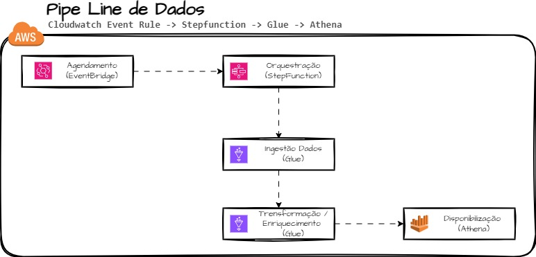

# Pipe Line de Dados
## Cloudwatch Event Rule -> Stepfunction -> Glue -> Athena

Este projeto tem como objetivo desenvolver um pipeline de ETL (Extração, Transformação 
e Carga) utilizando o Cloudwatch Event Rule para fazer o agendamento de Execução, Step Function para orquestrar a execução e o GLue para processar os dados. 
A solução envolve a captura de dados via API, processamento e transformação 
dos dados conforme necessário e finalmente a carga dos dados transformados em um bucket S3 para armazenamento.

Tudo isso comtruido com IaC utilizando o Terraform.

## Prerquisitos
Para este projeto precisaremos de alguns pontos:
- [Terraform Intalado](https://developer.hashicorp.com/terraform/tutorials/aws-get-started/install-cli)
- [Chave da API de Clima para extração dos Dados](https://openweathermap.org/price)
- [Chave da API de Tradução de Texto do Azurem para enriquecimento de dados](https://learn.microsoft.com/pt-br/azure/ai-services/translator/reference/rest-api-guide)
- [Git Instalado](https://git-scm.com/book/pt-br/v2/Come%C3%A7ando-Instalando-o-Git)
- [Conta na AWS](https://aws.amazon.com/pt/free/?gclid=Cj0KCQjwsuSzBhCLARIsAIcdLm7dSnsi5Nef0hTMamzgDrREUz-h5HZvJwK5OdJt5a8Yu5yEqDaB5xkaAtzSEALw_wcB&trk=9eeea834-765c-4895-95ec-d2fb1a1a573d&sc_channel=ps&ef_id=Cj0KCQjwsuSzBhCLARIsAIcdLm7dSnsi5Nef0hTMamzgDrREUz-h5HZvJwK5OdJt5a8Yu5yEqDaB5xkaAtzSEALw_wcB:G:s&s_kwcid=AL!4422!3!561843094998!p!!g!!amazon%20aws!15278604641!130587773020&all-free-tier.sort-by=item.additionalFields.SortRank&all-free-tier.sort-order=asc&awsf.Free%20Tier%20Types=*all&awsf.Free%20Tier%20Categories=*all)
- [AWS CLI Instalado](https://docs.aws.amazon.com/pt_br/cli/latest/userguide/getting-started-install.html)
- [Configure o AWS CLI](https://docs.aws.amazon.com/pt_br/cli/latest/userguide/cli-configure-envvars.html)
## Arquitetura
 


## Utilizando o Repo
1. Abra um terminal e navegue até a pasta onde deseja baixar o repositorio
2. Clone o Repositorio
```bash
git clone https://github.com/AleTavares/pipelineStepFunctionGlue.git
```
3. Entre na pasta 
```
cd pipelineStepFunctionGlue
```
4. Inicialize o Terraform
```hcl
terraform init 
```
5. Gere o Plano de Execução
```hcl
terraform plan -out plan.out
```
6. Aplique o Plano de Execução
```hcl
terraform apply plan.out
```

> [!IMPORTANT]  
>Após fazer todos os testes não se esqueça de apagar os Buckets e Destruir os recursos.
7. Comando para destruir os Recursos
```hcl
terraform destroy
```